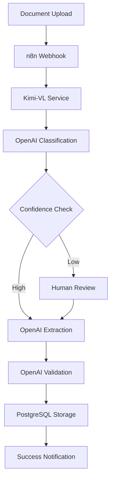

# Beyan Document Digitization System

> **🔄 AI-Powered Document Processing with n8n Workflow Automation**  
> **⚡ Transform Business Documents into Structured Data**  
> **🚀 Built with Kimi-VL, OpenAI, and Visual Workflow Management**

---

## 🎯 Overview

Beyan is an intelligent document digitization system that automatically processes business documents (invoices, packing lists, certificates) and extracts structured data using AI. The system leverages **n8n workflow automation** for visual orchestration, **Kimi-VL** for document understanding, and **OpenAI** for intelligent processing.

### ✨ Key Features

- **🤖 Multi-Agent AI Processing**: Specialized agents for classification, extraction, and validation
- **🔄 Visual Workflow Management**: n8n-powered workflow automation with no-code design
- **👤 Human-in-the-Loop**: Built-in review and approval workflows
- **📊 Real-time Monitoring**: Execution history, performance analytics, and error tracking
- **🔒 Enterprise Ready**: Secure, scalable, and production-ready deployment
- **🐳 Containerized**: Full Docker deployment with microservices architecture

## 🚀 Quick Start

### Prerequisites

- Docker & Docker Compose
- 8GB+ RAM (16GB+ recommended)
- NVIDIA GPU with 8GB+ VRAM (optional but recommended)
- 50GB+ free disk space

### 1. Clone and Setup

```bash
# Clone the repository
git clone <your-repo-url>
cd beyan

# Run setup script
./scripts/setup.sh

# Edit environment configuration
cp .env.example .env
# Edit .env with your API keys and configuration
```

### 2. Start the System

```bash
# Start all services
docker-compose up -d

# Check status
docker-compose ps

# View logs
docker-compose logs -f n8n
```

### 3. Access the System

- **n8n Workflow Interface**: http://localhost:5678
- **Kimi-VL API**: http://localhost:8001
- **API Documentation**: http://localhost:8001/docs

### 4. First Document Processing

1. Access n8n at http://localhost:5678 (admin/beyan_admin)
2. Import the sample workflow from `n8n/workflows/`
3. Upload a document via the webhook endpoint
4. Monitor processing in the n8n execution history

## 🏗️ Architecture

### System Components



### Technology Stack

| Component | Technology | Purpose |
|-----------|------------|---------|
| **Orchestration** | n8n | Visual workflow automation |
| **Document AI** | Kimi-VL | Vision-language model for document understanding |
| **Language AI** | OpenAI GPT-4 | Classification, extraction, validation |
| **Database** | PostgreSQL | Data persistence and workflow state |
| **Cache** | Redis | Performance optimization |
| **API** | FastAPI | Microservices and API endpoints |
| **Deployment** | Docker | Containerized services |
| **Monitoring** | n8n + Prometheus | Execution tracking and metrics |

## 📁 Project Structure

```
beyan/
├── docker-compose.yml          # Main orchestration
├── .env.example               # Environment template
├── README.md                  # This file
│
├── docs/                      # Documentation
│   ├── ai-docs/              # AI implementation guides
│   ├── system_docs/          # System design documents
│   └── sample_docs/          # Sample documents for testing
│
├── services/                  # Microservices
│   ├── kimi-vl/              # Kimi-VL document processing service
│   └── document-processor/   # Additional processing services
│
├── n8n/                      # n8n configuration
│   ├── workflows/            # Workflow definitions (JSON)
│   ├── credentials/          # Credentials backup
│   └── custom-nodes/         # Custom n8n nodes
│
├── config/                   # Configuration files
│   ├── nginx.conf           # Reverse proxy configuration
│   ├── postgres/            # Database initialization
│   └── monitoring/          # Monitoring configuration
│
├── data/                     # Data directories
│   ├── uploads/             # Document uploads
│   ├── processed/           # Processed documents
│   ├── models/              # AI model files
│   └── backups/             # Data backups
│
└── scripts/                  # Utility scripts
    ├── setup.sh             # Initial setup
    ├── backup.sh            # Backup script
    └── deploy.sh            # Deployment script
```

## 🔧 Configuration

### Environment Variables

Key configuration options in `.env`:

```bash
# n8n Configuration
N8N_USER=admin
N8N_PASSWORD=your_password
N8N_ENCRYPTION_KEY=your_32_char_key

# Database
POSTGRES_USER=beyan_user
POSTGRES_PASSWORD=your_db_password

# AI Services
OPENAI_API_KEY=your_openai_key
DEVICE=auto  # auto, cpu, cuda

# System
ENVIRONMENT=development
TIMEZONE=UTC
```

### Service Configuration

- **n8n**: Workflow automation platform
- **Kimi-VL**: Document processing service on port 8001
- **PostgreSQL**: Database on port 5432
- **Redis**: Cache on port 6379

## 📊 Monitoring

### Built-in Monitoring

- **n8n Execution History**: Visual workflow execution tracking
- **Service Health Checks**: Automated health monitoring
- **Performance Metrics**: Processing time and success rates

### Optional Advanced Monitoring

```bash
# Start with monitoring stack
docker-compose --profile monitoring up -d

# Access Grafana
open http://localhost:3000  # admin/admin
```

## 🔒 Security

### Production Security Checklist

- [ ] Change default passwords in `.env`
- [ ] Configure SSL certificates
- [ ] Set up firewall rules
- [ ] Enable authentication for all services
- [ ] Regular security updates
- [ ] Backup encryption

## 📚 Documentation

### Quick Links

- **[n8n Integration Guide](docs/ai-docs/n8n-integration-guide.md)** - Complete n8n setup and workflow patterns
- **[System Design](docs/system_docs/system_design.md)** - Architecture and design decisions
- **[API Documentation](http://localhost:8001/docs)** - Interactive API documentation
- **[Troubleshooting Guide](docs/system_docs/Quick_Start_Guide.md#troubleshooting)** - Common issues and solutions

### Implementation Guides

- **[Multi-Agent Framework Analysis](docs/ai-docs/multi-agent-framework-analysis-2025.md)** - Framework comparison and recommendations
- **[OpenAI Integration](docs/ai-docs/openai-native-implementation-guide.md)** - OpenAI-based implementation
- **[Local Deployment](docs/ai-docs/local-multi-agent-implementation.md)** - Fully local setup with Ollama

## 🤝 Contributing

1. Fork the repository
2. Create a feature branch
3. Make your changes
4. Add tests and documentation
5. Submit a pull request

## 📄 License

This project is licensed under the MIT License - see the LICENSE file for details.

## 🆘 Support

- **Issues**: GitHub Issues for bug reports and feature requests
- **Documentation**: Comprehensive guides in the `docs/` directory
- **Community**: Join our discussions for questions and support

---

**🎯 Ready to digitize your documents?** Follow the Quick Start guide and have your AI-powered document processing system running in minutes! 🚀
