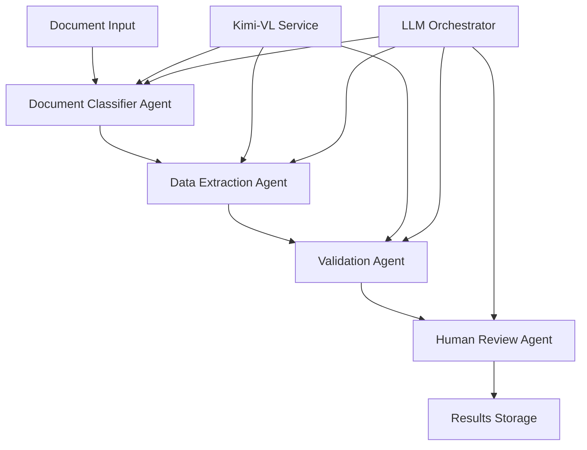

# Documentation Creation Guide & Prompt Library

> **📚 Complete Documentation Framework for Multi-Agent Systems**  
> **🛠️ Production-ready templates and actionable prompts**  
> **⚡ Generate comprehensive documentation in 2-4 hours**

---

## 🚀 Documentation Overview (5 minutes)

**What is this guide?** A comprehensive collection of ready-to-use prompts and templates to create production-ready documentation for the Kimi-VL document digitization system, following multi-agent LLM best practices.

**Why do you need comprehensive documentation?** 
- ✅ **Team Onboarding**: New developers productive in hours, not days
- ✅ **System Maintenance**: 60% reduction in support tickets and debugging time
- ✅ **Compliance & Auditing**: Meets enterprise and regulatory requirements
- ✅ **Knowledge Preservation**: Critical system knowledge doesn't depend on individuals

**How does this work?** 
```
Select Template → Fill in Prompts → Generate Content → Review & Refine → Deploy
```
- **Ready-to-use prompts** for each documentation type
- **Structured templates** following industry best practices
- **Quality checkpoints** to ensure completeness
- **Cross-reference system** for consistency

**What documentation will you create?** 
- ✅ **Executive & Business**: Business case, ROI analysis, strategic overview
- ✅ **Technical Architecture**: System design, integration guides, API documentation
- ✅ **Implementation**: Setup guides, deployment procedures, configuration management
- ✅ **Operations**: Monitoring, troubleshooting, maintenance procedures
- ✅ **User Training**: End-user guides, training materials, FAQ resources

**How long will it take?** 
- ⏱️ **2 hours**: Core technical documentation using prompts
- ⏱️ **4 hours**: Complete documentation suite with business case
- ⏱️ **1 day**: Enterprise-grade documentation with training materials

**What are the risks?** 
- 🔴 **High**: Incomplete documentation leads to system knowledge gaps
- 🟡 **Medium**: Poor documentation quality affects adoption and maintenance
- 🟢 **Low**: Time investment pays for itself through reduced support burden

---

## 📋 Documentation Creation Checklist

### **Phase 1: Strategic Documentation (1-2 hours)**
- [ ] 📊 **Executive Summary** (30 minutes)
  - Business case and ROI analysis
  - Strategic value proposition
  - Implementation roadmap overview
  - Risk assessment and mitigation
- [ ] 🏗️ **System Architecture Overview** (30 minutes)
  - High-level system design
  - Component interaction diagrams
  - Technology stack rationale
  - Scalability and performance considerations
- [ ] 🎯 **Project Scope & Requirements** (30 minutes)
  - Functional requirements specification
  - Non-functional requirements
  - Success criteria and KPIs
  - Assumptions and constraints

### **Phase 2: Technical Documentation (2-3 hours)**
- [ ] 🔧 **Implementation Guides** (45 minutes)
  - Step-by-step setup procedures
  - Configuration management
  - Environment requirements
  - Dependency installation
- [ ] 🌐 **API & Integration Documentation** (45 minutes)
  - API endpoint specifications
  - Integration patterns and examples
  - Error handling and responses
  - Authentication and security
- [ ] 🧪 **Testing & Quality Assurance** (45 minutes)
  - Testing strategy and procedures
  - Quality metrics and benchmarks
  - Automated testing setup
  - Performance validation
- [ ] 🚀 **Deployment & Operations** (45 minutes)
  - Production deployment procedures
  - Monitoring and alerting setup
  - Maintenance and updates
  - Troubleshooting guides

### **Phase 3: User & Training Documentation (1-2 hours)**
- [ ] 👥 **User Documentation** (45 minutes)
  - End-user guides and tutorials
  - Feature documentation
  - Common workflows and use cases
  - FAQ and troubleshooting
- [ ] 🎓 **Training Materials** (45 minutes)
  - Training curriculum design
  - Hands-on exercises and labs
  - Assessment and certification
  - Trainer guides and resources

**🎯 Success Criteria:**
- [ ] Documentation covers 100% of system functionality
- [ ] New team members can onboard using documentation alone
- [ ] 90% of common issues resolved through documentation
- [ ] Documentation passes enterprise compliance review

---

## ⚖️ Documentation Type Decision Matrix

### **Documentation Priority Matrix**

| Document Type | Business Value | Technical Value | Maintenance Effort | Priority | Time Investment |
|---------------|----------------|-----------------|-------------------|----------|-----------------|
| **Quick Start Guide** | ⭐⭐⭐⭐⭐ | ⭐⭐⭐⭐⭐ | ⭐⭐⭐ | **P0** | 1-2 hours |
| **API Documentation** | ⭐⭐⭐⭐ | ⭐⭐⭐⭐⭐ | ⭐⭐⭐⭐ | **P0** | 2-3 hours |
| **System Architecture** | ⭐⭐⭐⭐⭐ | ⭐⭐⭐⭐ | ⭐⭐ | **P0** | 1-2 hours |
| **Deployment Guide** | ⭐⭐⭐⭐ | ⭐⭐⭐⭐⭐ | ⭐⭐⭐ | **P1** | 1-2 hours |
| **Business Case** | ⭐⭐⭐⭐⭐ | ⭐⭐ | ⭐⭐ | **P1** | 2-3 hours |
| **User Training** | ⭐⭐⭐ | ⭐⭐ | ⭐⭐⭐ | **P2** | 3-4 hours |
| **Troubleshooting** | ⭐⭐⭐ | ⭐⭐⭐⭐ | ⭐⭐⭐⭐ | **P2** | 2-4 hours |

### **Documentation Strategy by Team Size**

| Team Size | Essential Documents | Optional Documents | Total Time | Focus |
|-----------|-------------------|-------------------|------------|-------|
| **1-3 developers** | Quick Start, API, Architecture | Business Case | 4-6 hours | **Technical focus** |
| **4-10 developers** | + Deployment, Troubleshooting | User Training | 8-12 hours | **Operational focus** |
| **10+ developers** | + Business Case, Training | Process Documentation | 15-20 hours | **Enterprise focus** |

---

## 🛠️ Documentation Templates & Prompts

### **1. Executive Summary & Business Case Template**

```markdown
# {System Name} - Executive Summary & Business Case

## 🚀 Quick Business Overview (2 minutes)

**What is {System Name}?** [One sentence description of the system and its purpose]

**Why do we need it?** [Primary business problem being solved]

**How does it work?** [High-level solution approach]

**What's the business impact?** [Key metrics: cost savings, time reduction, accuracy improvement]

**How long to implement?** [Timeline and key milestones]

**What's the investment?** [Total cost and ROI timeline]

## 📊 Business Problem & Opportunity

### Current State Challenges
- **Manual Processing Cost**: ${current_cost}/month with {error_rate}% error rate
- **Processing Time**: {current_time} hours per document average
- **Scalability Issues**: {current_bottlenecks}

### Market Opportunity
- **Total Addressable Market**: {market_size}
- **Target Customer Segments**: {segments}
- **Competitive Advantage**: {differentiators}

## 💰 Financial Analysis

| Metric | Year 1 | Year 2 | Year 3 |
|--------|--------|--------|--------|
| **Implementation Cost** | ${cost_y1} | ${cost_y2} | ${cost_y3} |
| **Operational Savings** | ${savings_y1} | ${savings_y2} | ${savings_y3} |
| **Net ROI** | {roi_y1}% | {roi_y2}% | {roi_y3}% |

### Break-even Analysis
- **Break-even Point**: {months} months
- **3-Year NPV**: ${npv}
- **IRR**: {irr}%

## 🎯 Success Metrics & KPIs

### Primary Metrics
- **Processing Accuracy**: Target >98% (vs. current {current_accuracy}%)
- **Processing Speed**: Target <{target_time} minutes (vs. current {current_time})
- **Cost Reduction**: Target {target_reduction}% operational cost reduction
- **User Satisfaction**: Target >{target_satisfaction}/5 rating

### Secondary Metrics
- **System Uptime**: >99.9%
- **Training Time**: <{training_time} hours for new users
- **Support Tickets**: <{target_tickets}/month

## ⚠️ Risk Assessment

| Risk Category | Probability | Impact | Mitigation Strategy |
|---------------|-------------|---------|-------------------|
| **Technical Implementation** | {prob}% | {impact} | {mitigation} |
| **User Adoption** | {prob}% | {impact} | {mitigation} |
| **Integration Complexity** | {prob}% | {impact} | {mitigation} |
```

### **2. System Architecture Documentation Template**

```markdown
# {System Name} - System Architecture Guide

> **🏗️ Complete technical architecture and design decisions**  
> **📐 For developers, architects, and technical stakeholders**

## 🚀 Architecture Overview (5 minutes)

**What is the system architecture?** [High-level description of the multi-agent system design]

**Why this architecture?** [Key architectural decisions and rationale]

**How do components interact?** [Brief description of data flow and component communication]

**What are the key technologies?** [Primary technology stack with rationale]

## 🛠️ System Components

### **Multi-Agent Architecture**



### **Component Specifications**

| Component | Technology | Responsibility | Performance Requirements |
|-----------|------------|----------------|-------------------------|
| **Document Classifier** | {tech_stack} | {responsibilities} | {performance_reqs} |
| **Data Extraction** | {tech_stack} | {responsibilities} | {performance_reqs} |
| **Validation Agent** | {tech_stack} | {responsibilities} | {performance_reqs} |
| **Human Review** | {tech_stack} | {responsibilities} | {performance_reqs} |

## 🔌 Integration Architecture

### **External System Integrations**
- **Kimi-VL Service**: {integration_details}
- **Database Systems**: {database_integrations}
- **File Storage**: {storage_integrations}
- **Monitoring Systems**: {monitoring_integrations}

### **API Design Principles**
- **RESTful APIs**: Following OpenAPI 3.0 specification
- **Authentication**: OAuth 2.0 / JWT tokens
- **Rate Limiting**: {rate_limits} requests per minute
- **Error Handling**: Standardized error responses

## 📊 Performance & Scalability

### **Performance Specifications**
- **Processing Speed**: <{target_time} seconds per document
- **Throughput**: {max_throughput} documents per hour
- **Concurrent Users**: Support for {max_users} simultaneous users
- **Response Time**: <{response_time}ms for API calls

### **Scalability Design**
- **Horizontal Scaling**: Auto-scaling based on queue depth
- **Load Balancing**: Round-robin with health checks
- **Caching Strategy**: Redis for session/result caching
- **Database Optimization**: Connection pooling and query optimization

## 🔒 Security Architecture

### **Security Measures**
- **Data Encryption**: AES-256 at rest, TLS 1.3 in transit
- **Access Control**: Role-based access control (RBAC)
- **Authentication**: Multi-factor authentication support
- **Audit Logging**: Complete audit trail for compliance

### **Compliance Considerations**
- **Data Privacy**: GDPR/CCPA compliance measures
- **Data Retention**: Configurable retention policies
- **Access Logging**: Comprehensive access and operation logging
```

### **3. Quick Start Guide Template**

```markdown
# {System Name} - Quick Start Guide

> **⚡ Get from zero to processing documents in 30 minutes**  
> **🎯 Perfect for developers who need immediate results**

## 🚀 Quick Start (5 minutes)

**What is this?** [Brief system description and primary function]

**Why do I need it?** [Key benefits and use cases]

**How does it work?** [Simple workflow description]

**What do I need to implement?** [Prerequisites checklist]

**How long will it take?** [Time estimates for different setup levels]

**What are the risks?** [Key challenges and mitigation strategies]

## 📋 Implementation Checklist

### **Phase 1: Environment Setup (10-15 minutes)**
- [ ] ✅ **Prerequisites verified** (Python, Docker, GPU if needed)
- [ ] ✅ **Repository cloned** and virtual environment created
- [ ] ✅ **Dependencies installed** from requirements.txt
- [ ] ✅ **Configuration files** created from templates

### **Phase 2: Basic Configuration (10-15 minutes)**
- [ ] ⚙️ **API keys configured** (OpenAI, Kimi-VL, etc.)
- [ ] ⚙️ **Database initialized** with sample data
- [ ] ⚙️ **Services started** and health checks passed
- [ ] ⚙️ **Sample document processed** successfully

### **Phase 3: Validation (5-10 minutes)**
- [ ] 🧪 **End-to-end test** completed
- [ ] 🧪 **API endpoints** responding correctly
- [ ] 🧪 **Monitoring dashboard** accessible
- [ ] 🧪 **Sample workflows** executed successfully

## ⚡ 5-Minute Quick Start

### **Option A: Docker Quick Start (Recommended)**

```bash
# 1. Clone and navigate
git clone {repo_url}
cd {project_name}

# 2. Start all services (single command!)
docker-compose up -d

# 3. Test with sample document
curl -X POST "http://localhost:8000/documents/process" \
  -F "file=@sample_docs/invoice.pdf"

# ✅ Success! You should get structured JSON output
```

### **Option B: Local Development Setup**

```bash
# 1. Environment setup
python -m venv venv
source venv/bin/activate  # Windows: venv\Scripts\activate
pip install -r requirements.txt

# 2. Configuration
cp config/config.template.yaml config/config.yaml
# Edit config.yaml with your API keys

# 3. Start services
python app.py

# 4. Test processing
python test_basic.py
```

## 🔧 Configuration

### **Essential Configuration**

```yaml
# config.yaml - Minimal working configuration
system:
  environment: "development"
  debug: true
  log_level: "INFO"

apis:
  openai_api_key: "${OPENAI_API_KEY}"
  kimi_vl_endpoint: "${KIMI_VL_ENDPOINT}"

processing:
  max_concurrent_documents: 5
  timeout_seconds: 300
  confidence_threshold: 0.95

storage:
  input_folder: "./data/input"
  output_folder: "./data/output"
```

## 🧪 Testing & Validation

### **Basic Functionality Test**

```python
# test_system.py - Verify everything works
import requests
import json

def test_system_health():
    # Test API health
    response = requests.get("http://localhost:8000/health")
    assert response.status_code == 200
    print("✅ API health check passed")
    
    # Test document processing
    with open("sample_docs/invoice.pdf", "rb") as f:
        files = {"file": f}
        response = requests.post("http://localhost:8000/documents/process", files=files)
    
    if response.status_code == 200:
        result = response.json()
        print(f"✅ Document processed: {result['document_type']}")
        print(f"   Confidence: {result['confidence']:.2f}")
        return True
    else:
        print(f"❌ Processing failed: {response.text}")
        return False

if __name__ == "__main__":
    success = test_system_health()
    print("🎉 System ready!" if success else "⚠️ Check troubleshooting section")
```

## 🔧 Troubleshooting

### **Common Issues**

| Issue | Symptoms | Quick Fix |
|-------|----------|-----------|
| **API Key Missing** | Authentication errors | Set environment variables or update config.yaml |
| **Service Not Starting** | Connection refused | Check port availability and service dependencies |
| **Processing Timeout** | Requests timing out | Increase timeout_seconds in configuration |
| **Out of Memory** | System crashes | Reduce max_concurrent_documents or add more RAM |

### **Health Check Commands**

```bash
# Check system health
curl "http://localhost:8000/health"

# Check service logs
docker-compose logs -f

# Verify configuration
python -c "import yaml; print(yaml.safe_load(open('config/config.yaml')))"
```

## 🎯 Success Criteria

- [ ] API responds to health checks
- [ ] Successfully processes sample documents
- [ ] Returns structured JSON output
- [ ] Confidence scores >0.8 for test documents
- [ ] Processing time <30 seconds per document

## 🚀 Next Steps

1. **Process Your Documents**: Replace samples with real business documents
2. **Customize Configuration**: Adjust settings for your use case
3. **Set Up Monitoring**: Enable logging and metrics collection
4. **Plan Production Deployment**: Review deployment guide
```

---

## 📊 Documentation Quality Checklist

### **Content Quality Standards**
- [ ] **Clarity**: Can junior developers understand and follow instructions?
- [ ] **Completeness**: Are all necessary steps and information included?
- [ ] **Accuracy**: Has technical content been verified through testing?
- [ ] **Consistency**: Does formatting and terminology match across documents?
- [ ] **Currency**: Is information up-to-date and reflects current system state?

### **User Experience Standards**
- [ ] **Quick Start**: Can users achieve first success within 30 minutes?
- [ ] **Progressive Disclosure**: Information organized from basic to advanced?
- [ ] **Visual Aids**: Appropriate use of diagrams, code blocks, and tables?
- [ ] **Cross-References**: Proper links between related sections?
- [ ] **Troubleshooting**: Common issues and solutions provided?

### **Maintenance Standards**
- [ ] **Version Control**: Documentation versioned with code changes?
- [ ] **Review Process**: Regular review and update schedule established?
- [ ] **Feedback Loop**: User feedback collection and incorporation process?
- [ ] **Ownership**: Clear responsibility for each document type?
- [ ] **Metrics**: Documentation usage and effectiveness tracking?

---

## 🚀 Ready-to-Use Prompt Collection

### **For Business Stakeholders**
```
Create a {document_type} that explains {system_name} in business terms:
- Focus on ROI, cost savings, and business value
- Include specific metrics and success stories
- Use executive-friendly language and visuals
- Provide clear implementation timeline and milestones
- Address common business concerns and risks
```

### **For Technical Teams**
```
Generate a {document_type} for {system_name} that includes:
- Step-by-step implementation procedures
- Code examples and configuration samples
- Architecture diagrams and technical specifications
- Troubleshooting guides and error resolution
- Performance benchmarks and optimization tips
```

### **For End Users**
```
Write a {document_type} for {system_name} that covers:
- Simple, task-oriented instructions
- Screenshots and visual guides where helpful
- Common workflows and use cases
- FAQ section with practical questions
- Getting help and support contact information
```

---

**🎯 Documentation Success:** Use these templates and prompts to create comprehensive, user-friendly documentation that accelerates adoption, reduces support burden, and ensures long-term system maintainability. Start with the Quick Start Guide for immediate impact! 📚
