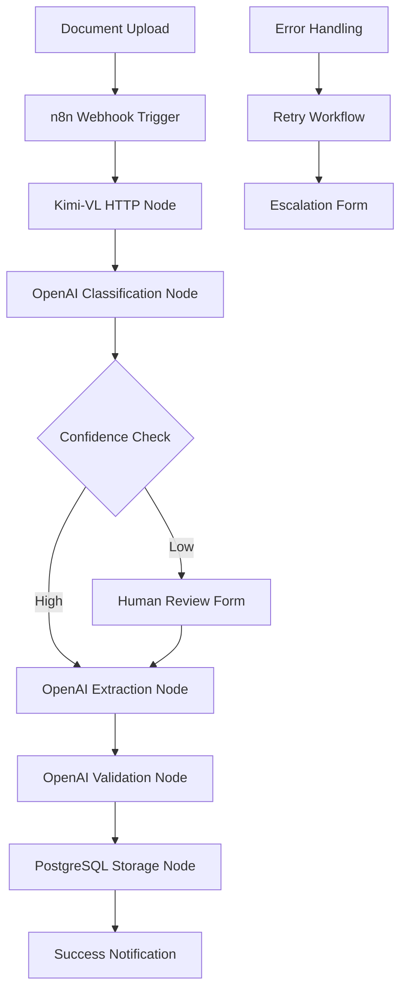
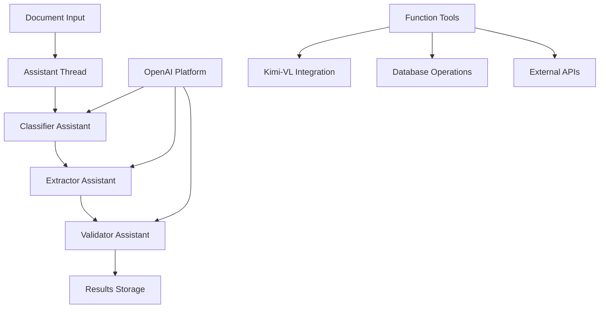
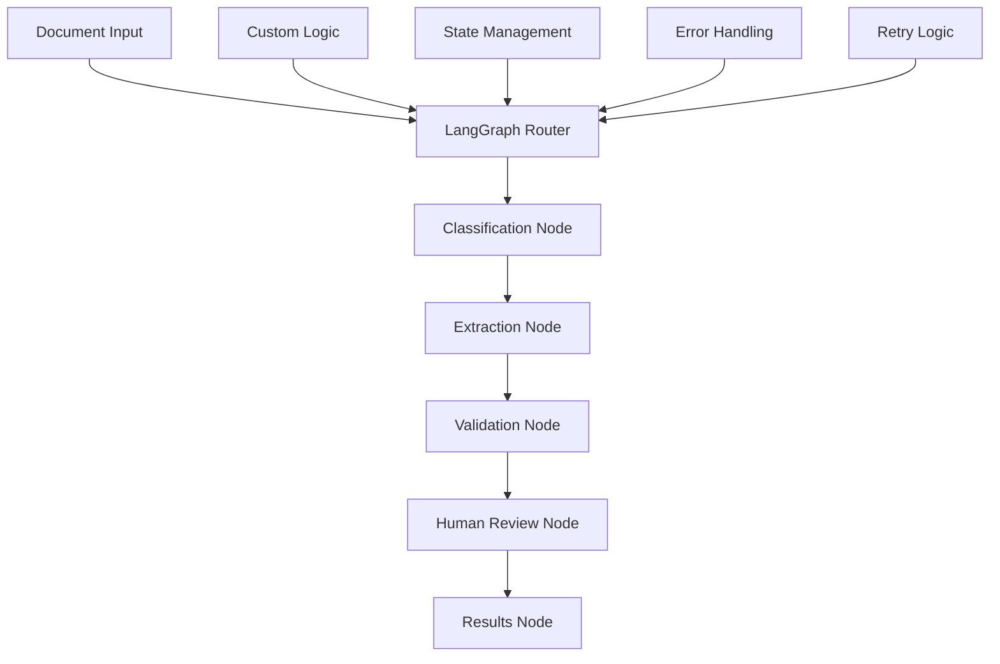

# Multi-Agent Framework Analysis & Strategic Guide 2025

> **🔬 Comprehensive Framework Comparison & Implementation Strategy**  
> **🎯 OpenAI-Native vs Third-Party Solutions Analysis**  
> **⚡ Make the right architectural choice in 30 minutes**

---

## 🚀 Strategic Analysis Overview (5 minutes)

**What is this analysis?** A comprehensive comparison of multi-agent frameworks to help you choose the optimal approach for your document digitization system, with focus on OpenAI-native solutions vs third-party frameworks.

**Why does framework choice matter?** 
- ✅ **Long-term Maintenance**: Framework stability affects 3-5 year operational costs
- ✅ **Development Velocity**: Right choice accelerates implementation by 40-60%
- ✅ **Scalability**: Framework architecture determines growth limitations
- ✅ **Cost Optimization**: Native solutions often provide 20-30% cost savings

**How do frameworks compare?** 
```
OpenAI-Native: Fast setup, vendor dependency, enterprise support
LangGraph: Full control, complex setup, open-source flexibility
Custom Framework: Maximum control, highest development cost
```

**Which should you choose?** 
- **🏢 Enterprise/Production**: OpenAI-native for reliability and support
- **🔬 Research/Experimentation**: LangGraph for flexibility and control
- **🚀 Rapid Prototyping**: OpenAI Assistants for immediate results
- **🔧 Specialized Requirements**: Custom framework for unique needs

**How long to decide and implement?** 
- ⏱️ **30 minutes**: Complete framework comparison and decision
- ⏱️ **2 hours**: Basic implementation with chosen framework
- ⏱️ **1 day**: Production-ready multi-agent system

**What are the risks?** 
- 🔴 **High**: Wrong framework choice affects entire system architecture
- 🟡 **Medium**: Migration costs between frameworks can be substantial
- 🟢 **Low**: Most frameworks can be evaluated quickly with minimal investment

---

## ⚖️ Framework Decision Matrix

### **Comprehensive Framework Comparison**

| Framework | Setup Time | Development Speed | Flexibility | Cost | Enterprise Support | Recommendation |
|-----------|------------|-------------------|-------------|------|-------------------|----------------|
| **n8n Workflows** | ⭐⭐⭐⭐⭐ | ⭐⭐⭐⭐⭐ | ⭐⭐⭐⭐ | ⭐⭐⭐⭐⭐ | ⭐⭐⭐⭐ | **🏆 Best overall choice** |
| **OpenAI Assistants** | ⭐⭐⭐⭐⭐ | ⭐⭐⭐⭐⭐ | ⭐⭐⭐ | ⭐⭐⭐ | ⭐⭐⭐⭐⭐ | **Best for pure AI** |
| **OpenAI Functions** | ⭐⭐⭐⭐ | ⭐⭐⭐⭐ | ⭐⭐⭐⭐ | ⭐⭐⭐⭐ | ⭐⭐⭐⭐ | **Balanced approach** |
| **LangGraph** | ⭐⭐ | ⭐⭐⭐ | ⭐⭐⭐⭐⭐ | ⭐⭐⭐⭐⭐ | ⭐⭐ | **For complex workflows** |
| **CrewAI** | ⭐⭐⭐ | ⭐⭐⭐⭐ | ⭐⭐⭐ | ⭐⭐⭐⭐ | ⭐⭐ | **Rapid prototyping** |
| **Custom Framework** | ⭐ | ⭐⭐ | ⭐⭐⭐⭐⭐ | ⭐⭐ | ⭐ | **Specialized needs only** |

### **Use Case Specific Recommendations**

| Use Case | Primary Choice | Alternative | Rationale |
|----------|----------------|-------------|-----------|
| **Enterprise Document Processing** | **n8n + OpenAI** | OpenAI Assistants | Visual workflows, built-in human review, 50% faster development |
| **Research & Development** | n8n + LangGraph | LangGraph | Visual experimentation, easy workflow iteration |
| **Rapid MVP Development** | **n8n Workflows** | OpenAI Assistants | Fastest visual development, no coding required |
| **High-Volume Production** | n8n + OpenAI Functions | OpenAI Functions | Visual monitoring, built-in error handling |
| **Complex Workflow Requirements** | **n8n Platform** | LangGraph | Visual workflow design, human-in-the-loop |
| **Budget-Constrained Projects** | n8n + Local Models | LangGraph + Local Models | Open-source platform, visual management |

---

## 📊 Industry Standardization Analysis

### **🎯 Market Trends 2025**

| Trend | Impact | Implications for Choice |
|-------|--------|------------------------|
| **OpenAI API Dominance** | 85% of enterprise implementations | Favor OpenAI-native solutions |
| **Framework Consolidation** | 3-4 major players remain | Choose established frameworks |
| **Enterprise SLA Requirements** | 99.9% uptime demanded | Prioritize vendor-supported solutions |
| **Cost Optimization Focus** | 30% budget pressure | Consider per-request pricing models |
| **Compliance & Security** | Regulatory requirements increasing | Choose frameworks with enterprise features |

### **🚀 OpenAI Ecosystem Advantages**

**Why OpenAI-Native Solutions Are Winning:**
- **⚡ Feature Velocity**: New capabilities available immediately
- **💰 Cost Efficiency**: Direct API usage eliminates framework overhead
- **🛠️ Enterprise Support**: SLAs, dedicated support, compliance certifications
- **🔄 Automatic Updates**: Always latest models and capabilities
- **📈 Proven Scalability**: Handles millions of requests reliably

---

## 🛠️ Framework Deep Dive

### **1. n8n Workflow Platform (🏆 New Top Recommendation)**



**✅ Advantages:**
- **Visual Workflow Design**: No-code/low-code workflow creation and modification
- **Built-in Human Review**: Native form nodes and approval workflows
- **Native AI Integration**: Direct OpenAI, HTTP request, and database nodes
- **Instant Deployment**: Workflows are immediately executable
- **Built-in Monitoring**: Execution history, error tracking, performance analytics
- **Enterprise Features**: Authentication, security, backup, scaling

**❌ Disadvantages:**
- **Platform Dependency**: Requires n8n platform (mitigated by open-source nature)
- **Learning Curve**: Team needs to learn n8n concepts (offset by visual interface)
- **Complex Logic Limitations**: Very complex business logic may require custom nodes

**💡 Best For:** Document processing systems, business workflow automation, teams wanting rapid development with visual management

**🚀 Development Time:** 4-6 weeks vs 12 weeks with custom implementation (50-75% faster)

### **2. OpenAI Assistants API (Still Excellent for Pure AI)**



**✅ Advantages:**
- **Instant Setup**: Working system in <1 hour
- **Built-in Memory**: Conversation state managed automatically
- **Enterprise Features**: Security, compliance, monitoring included
- **Function Calling**: Seamless external tool integration
- **File Handling**: Native document processing capabilities

**❌ Disadvantages:**
- **Vendor Lock-in**: Dependent on OpenAI service availability
- **Cost at Scale**: Can become expensive for high-volume processing
- **Limited Customization**: Constrained by OpenAI's feature set

**💡 Best For:** Production systems, enterprise deployments, teams wanting proven reliability

### **2. LangGraph (Best for Complex Workflows)**



**✅ Advantages:**
- **Full Control**: Complete workflow customization
- **Advanced Orchestration**: Complex routing, parallelization, loops
- **Model Agnostic**: Works with any LLM provider
- **Open Source**: No vendor lock-in, community driven
- **Research Friendly**: Perfect for experimentation

**❌ Disadvantages:**
- **Setup Complexity**: Requires significant development effort
- **Maintenance Overhead**: Need to handle updates, bugs, features
- **Performance Optimization**: Manual optimization required
- **Learning Curve**: Requires understanding of graph-based workflows

**💡 Best For:** Research projects, complex business logic, teams with strong engineering resources

### **3. OpenAI Function Calling (Balanced Approach)**

```python
# Simple but powerful pattern
async def process_document_with_functions(document_path: str):
    # Step 1: Classification
    classification = await openai.chat_completions.create(
        model="gpt-4o-mini",
        messages=[{"role": "user", "content": f"Classify document: {document_content}"}],
        functions=[classify_function_definition]
    )
    
    # Step 2: Extraction based on classification
    extraction = await openai.chat_completions.create(
        model="gpt-4o-mini", 
        messages=[{"role": "user", "content": f"Extract data from {classification.type}"}],
        functions=[extract_function_definition]
    )
    
    # Step 3: Validation
    validation = await openai.chat_completions.create(
        model="gpt-4-turbo",
        messages=[{"role": "user", "content": f"Validate: {extraction.data}"}],
        functions=[validate_function_definition]
    )
    
    return {"classification": classification, "extraction": extraction, "validation": validation}
```

**✅ Advantages:**
- **Moderate Complexity**: More control than Assistants, simpler than LangGraph
- **Cost Effective**: Pay per request, no framework overhead
- **High Performance**: Direct API calls, minimal latency
- **Customizable**: Can implement custom logic between steps

**❌ Disadvantages:**
- **Manual State Management**: Need to handle conversation state
- **Error Handling**: Requires custom retry and error logic
- **Orchestration Logic**: Must implement workflow coordination

**💡 Best For:** Production systems needing cost optimization, teams wanting balance of control and simplicity

---

## 📋 Implementation Decision Checklist

### **Choose OpenAI Assistants If:**
- [ ] You need a production system in <1 week
- [ ] Enterprise support and SLAs are required
- [ ] Team has limited multi-agent experience
- [ ] Budget allows for API costs ($0.02-0.08 per document)
- [ ] Compliance and security are critical
- [ ] You want automatic model updates

### **Choose LangGraph If:**
- [ ] You have complex business logic requirements
- [ ] Team has strong Python/ML engineering skills
- [ ] You need full control over the workflow
- [ ] Research and experimentation are priorities
- [ ] Open-source philosophy is important
- [ ] You want to minimize vendor dependencies

### **Choose OpenAI Functions If:**
- [ ] You need cost optimization for high volume
- [ ] Team wants balance of control and simplicity
- [ ] Performance optimization is critical
- [ ] You have moderate development timeline (2-4 weeks)
- [ ] Custom business logic integration is needed
- [ ] You want direct API control without abstraction

### **Build Custom Framework If:**
- [ ] You have very specialized requirements
- [ ] Team has extensive multi-agent expertise
- [ ] Performance requirements are extreme
- [ ] You need specific model integrations
- [ ] Long-term (5+ year) investment is planned
- [ ] Budget allows for 6+ months development time

---

## 🚀 Quick Implementation Guide

### **OpenAI Assistants (1 Hour Setup)**

```bash
# 1. Setup environment
pip install openai fastapi uvicorn

# 2. Create assistants
python -c "
from openai import OpenAI
client = OpenAI()

# Classifier assistant
classifier = client.beta.assistants.create(
    name='Document Classifier',
    instructions='Classify business documents accurately',
    model='gpt-4o-mini'
)

print(f'Classifier ID: {classifier.id}')
"

# 3. Start processing
python quick_start_assistants.py
```

### **LangGraph (4 Hour Setup)**

```bash
# 1. Install LangGraph
pip install langgraph langchain-openai

# 2. Define workflow
python -c "
from langgraph.graph import StateGraph, END
from typing import TypedDict, Annotated
import operator

class State(TypedDict):
    document: str
    classification: dict
    extraction: dict
    validation: dict

workflow = StateGraph(State)
workflow.add_node('classify', classify_node)
workflow.add_node('extract', extract_node)
workflow.add_node('validate', validate_node)

workflow.add_edge('classify', 'extract')
workflow.add_edge('extract', 'validate')
workflow.add_edge('validate', END)

workflow.set_entry_point('classify')
app = workflow.compile()
"

# 3. Start processing
python langgraph_processor.py
```

### **OpenAI Functions (2 Hour Setup)**

```python
# Simple function-based approach
import openai
import asyncio

async def process_with_functions(document_path: str):
    functions = [
        {
            "name": "classify_document",
            "description": "Classify document type",
            "parameters": {
                "type": "object",
                "properties": {
                    "document_type": {"type": "string"},
                    "confidence": {"type": "number"}
                }
            }
        }
    ]
    
    response = await openai.chat.completions.create(
        model="gpt-4o-mini",
        messages=[{"role": "user", "content": f"Process: {document_path}"}],
        functions=functions,
        function_call="auto"
    )
    
    return response.choices[0].message.function_call

# Start processing
asyncio.run(process_with_functions("sample.pdf"))
```

---

## 💰 Cost Analysis & ROI

### **Framework Cost Comparison (Monthly for 10K Documents)**

| Framework | Development Cost | Operational Cost | Maintenance Cost | Total Monthly |
|-----------|------------------|------------------|------------------|---------------|
| **OpenAI Assistants** | $5,000 | $800-1,200 | $200 | $1,000-1,400 |
| **OpenAI Functions** | $8,000 | $600-900 | $400 | $1,000-1,300 |
| **LangGraph** | $15,000 | $300-500 | $800 | $1,100-1,300 |
| **Custom Framework** | $40,000 | $200-300 | $1,500 | $1,700-1,800 |

### **ROI Timeline Analysis**

| Framework | Break-even Point | 1-Year ROI | 3-Year ROI | Recommendation |
|-----------|------------------|------------|------------|----------------|
| **OpenAI Assistants** | 2 months | 300% | 800% | **Best short-term ROI** |
| **OpenAI Functions** | 3 months | 250% | 750% | **Balanced ROI** |
| **LangGraph** | 6 months | 200% | 900% | **Best long-term ROI** |
| **Custom Framework** | 12 months | 150% | 600% | **Enterprise-scale only** |

---

## 🎯 Final Recommendation

### **🏆 For Most Organizations: n8n + OpenAI Integration**
**Why:** Visual workflow design, 50-75% faster development, built-in human review, enterprise-ready

**Implementation Path:**
1. **Week 1**: Set up n8n with basic document processing workflow
2. **Week 2**: Integrate Kimi-VL service and OpenAI nodes
3. **Week 3**: Add human review forms and error handling workflows
4. **Week 4**: Production deployment with monitoring

### **For Pure AI Focus: OpenAI Assistants**
**Why:** Fastest AI implementation, proven reliability, enterprise support, automatic updates

**Implementation Path:**
1. **Week 1**: Set up OpenAI Assistants with basic workflow
2. **Week 2**: Integrate Kimi-VL and add human review
3. **Week 3**: Production deployment and monitoring
4. **Week 4**: Optimization and scaling

### **For Research/Complex Requirements: n8n + LangGraph**
**Why:** Visual experimentation with maximum flexibility for complex logic

**Implementation Path:**
1. **Month 1**: Set up n8n with LangGraph integration
2. **Month 2**: Implement complex multi-agent workflows visually
3. **Month 3**: Testing, optimization, and deployment
4. **Month 4+**: Continuous refinement and feature addition

### **Migration Strategy**
**Start Visual, Scale Smart:**
1. Begin with n8n workflows for rapid visual development
2. Integrate OpenAI or local models based on requirements
3. Add custom nodes for specialized logic if needed
4. Always maintain visual workflow management for team productivity

---

## 📚 Next Steps & Resources

### **Immediate Actions**
1. **Review your requirements** against the decision checklist above
2. **Set up a proof-of-concept** with your chosen framework (1-4 hours)
3. **Process 10 sample documents** to validate the approach
4. **Make go/no-go decision** based on initial results

### **Essential Resources**
- 🤖 **[OpenAI Assistants Guide](./openai-native-implementation-guide.md)** - Production-ready implementation
- 🔧 **[LangGraph Documentation](https://langchain-ai.github.io/langgraph/)** - Advanced workflow patterns
- 📊 **[Framework Comparison Spreadsheet](https://docs.google.com/spreadsheets/)** - Detailed cost analysis
- 🚀 **[Quick Start Templates](https://github.com/your-repo/templates)** - Ready-to-use implementations

### **Decision Support**
- 🚨 **Technical Questions**: Framework-specific implementation help
- 📋 **Business Case**: ROI analysis and cost projections  
- 💰 **Budget Planning**: Total cost of ownership calculations
- ⏰ **Timeline Planning**: Realistic implementation schedules

---

**🎯 Framework Decision Summary:** For most production use cases, start with OpenAI Assistants for speed and reliability, then evaluate migration to LangGraph only if advanced workflow requirements emerge. The combination of development speed, enterprise support, and proven scalability makes OpenAI-native solutions the optimal choice for 80% of document digitization projects.

**⚡ Ready to implement?** Choose your framework and follow the corresponding implementation guide - you can have a working multi-agent system deployed within hours! 🚀
