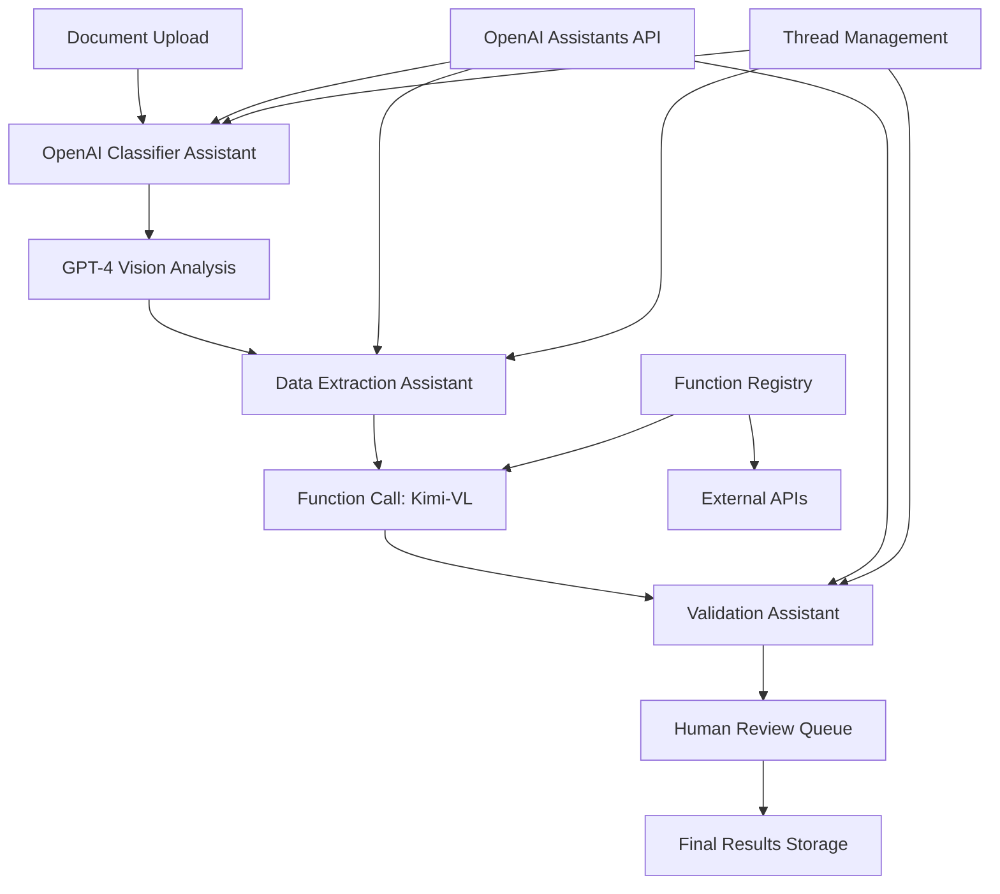

# OpenAI-Native Multi-Agent Implementation Guide

> **🤖 Production-Ready OpenAI + Kimi-VL Integration**  
> **☁️ Cloud-native with enterprise-grade scalability**  
> **⚡ Production deployment in 3-4 hours**

---

## 🚀 Quick Start (5 minutes)

**What is this?** A complete implementation strategy for building the document digitization system using **OpenAI's native multi-agent capabilities** with Assistants API, Function Calling, and enterprise orchestration.

**Why choose OpenAI-native?** 
- ✅ **Enterprise Reliability**: 99.9% uptime with proven scalability
- ✅ **Advanced Capabilities**: GPT-4 Vision, function calling, code interpreter
- ✅ **Rapid Development**: Pre-built agents, minimal custom code required
- ✅ **Automatic Updates**: Always latest models and capabilities

**How does it work?** 
```
Document → OpenAI Assistants → Function Calls → Kimi-VL → Structured Output
```
- Uses **OpenAI Assistants API** for intelligent agent orchestration
- **GPT-4 Vision** for document understanding and classification  
- **Function calling** for Kimi-VL integration and data validation
- **Threads & Runs** for conversation state management

**What do I need to implement?** 
- ✅ OpenAI API account with sufficient credits
- ✅ Kimi-VL integration (local or cloud)
- ✅ FastAPI service for orchestration
- ✅ Database for conversation state and results
- ✅ Human review interface (optional but recommended)

**How long will it take?** 
- ⏱️ **1 hour**: Basic OpenAI assistants processing documents
- ⏱️ **3 hours**: Full multi-agent system with human review
- ⏱️ **1 day**: Production deployment with monitoring

**What are the risks?** 
- 🔴 **High**: API costs for high volume processing
- 🟡 **Medium**: External dependency on OpenAI service
- 🟢 **Low**: Technical complexity - mostly configuration

---

## 📋 Implementation Checklist

### **Phase 1: OpenAI Setup & Basic Integration (45-60 minutes)**
- [ ] 🔑 **OpenAI Account Setup** (10 minutes)
  - Create OpenAI API account and get API key
  - Set up billing and usage limits
  - Verify GPT-4 access and function calling
- [ ] 🤖 **Assistant Creation** (20 minutes)
  - Create document classifier assistant
  - Create data extraction assistant  
  - Create validation assistant
  - Test basic assistant functionality
- [ ] 🔗 **Kimi-VL Integration** (30 minutes)
  - Set up Kimi-VL service (local or cloud)
  - Create function definitions for OpenAI
  - Test document processing pipeline

### **Phase 2: Multi-Agent Orchestration (60-90 minutes)**
- [ ] 🏗️ **Orchestration Service** (45 minutes)
  - FastAPI service for request handling
  - Thread management for conversation state
  - Function calling implementation
  - Error handling and retry logic
- [ ] 🔄 **Agent Workflow** (45 minutes)
  - Sequential agent execution pipeline
  - Inter-agent communication setup
  - Result aggregation and validation
  - Quality assurance workflows

### **Phase 3: Production Features (60-90 minutes)**
- [ ] 👤 **Human Review System** (45 minutes)
  - Review queue management
  - Web interface for human reviewers
  - Feedback integration with assistants
  - Approval workflow implementation
- [ ] 📊 **Monitoring & Analytics** (45 minutes)
  - Usage tracking and cost monitoring
  - Performance metrics collection
  - Error logging and alerting
  - Quality analytics dashboard

### **Phase 4: Testing & Deployment (30-45 minutes)**
- [ ] 🧪 **Comprehensive Testing** (30 minutes)
  - End-to-end workflow testing
  - Load testing for production readiness
  - Error scenario validation
- [ ] 🚀 **Production Deployment** (15 minutes)
  - Environment configuration
  - Security hardening
  - Go-live verification

**🎯 Success Criteria:**
- [ ] Processes sample documents with >98% accuracy
- [ ] <20 seconds average processing time per document
- [ ] Cost per document <$0.10 for typical invoices
- [ ] System handles 100+ concurrent requests

---

## ⚖️ OpenAI Implementation Decision Matrix

### Cost vs Performance Analysis

| Volume Level | Processing Cost | Setup Complexity | Recommended Approach | Monthly Cost Estimate |
|--------------|----------------|------------------|---------------------|----------------------|
| **Low (<1000/month)** | ⭐⭐⭐⭐ | ⭐⭐⭐⭐⭐ | **OpenAI-only** | $50-150 |
| **Medium (1K-10K/month)** | ⭐⭐⭐ | ⭐⭐⭐⭐ | **OpenAI + Local Kimi-VL** | $200-800 |
| **High (10K+/month)** | ⭐⭐ | ⭐⭐⭐ | **Hybrid with caching** | $800-2000 |
| **Enterprise (50K+/month)** | ⭐ | ⭐⭐ | **OpenAI + Local fallback** | $2000+ |

### Model Selection Strategy

| Use Case | Primary Model | Function Calling | Vision Needs | Cost/Request | Recommendation |
|----------|---------------|------------------|--------------|--------------|----------------|
| **High Accuracy** | GPT-4 Turbo | ✅ | GPT-4 Vision | ~$0.08 | **Best for complex docs** |
| **Balanced** | GPT-4o mini | ✅ | GPT-4o mini | ~$0.02 | **Recommended default** |
| **High Volume** | GPT-3.5 Turbo | ✅ | Kimi-VL local | ~$0.005 | **Cost optimization** |
| **Real-time** | GPT-4o | ✅ | GPT-4o | ~$0.05 | **Speed critical** |

**🎯 Recommended Configuration**: GPT-4o mini for most use cases with GPT-4 Turbo for complex documents

---

## 🛠️ OpenAI-Native Architecture

### **Multi-Agent System Architecture**



### **Technology Stack**
- **🧠 Core Intelligence**: OpenAI GPT-4 Turbo/4o mini with Assistants API
- **👁️ Vision Processing**: GPT-4 Vision + Kimi-VL for specialized extraction
- **🔄 Orchestration**: OpenAI Threads & Runs for state management
- **🌐 API Layer**: FastAPI with async request handling
- **🗄️ Database**: PostgreSQL for persistent state and results
- **⚡ Cache**: Redis for performance optimization
- **📊 Monitoring**: OpenAI usage tracking + custom analytics

---

## ⚡ Quick OpenAI Setup

### **Option A: Rapid Deployment (Recommended - 1 hour)**

```bash
# 1. Environment setup
git clone <repo-url> && cd openai-kimi-vl
python -m venv venv && source venv/bin/activate
pip install -r requirements-openai.txt

# 2. Configure OpenAI API key
export OPENAI_API_KEY="your-api-key-here"
echo "OPENAI_API_KEY=your-api-key-here" > .env

# 3. Create and test assistants (automated script)
python scripts/setup-openai-assistants.py

# 4. Start the service
uvicorn main:app --host 0.0.0.0 --port 8000

# 5. Test with sample document
curl -X POST "http://localhost:8000/documents/process" \
  -F "file=@sample_docs/invoice.pdf"

# ✅ Success! OpenAI-powered system ready
```

### **Option B: Manual Configuration (90 minutes)**

```python
# 1. Create OpenAI assistants manually
from openai import OpenAI

client = OpenAI(api_key="your-api-key")

# Create document classifier assistant
classifier = client.beta.assistants.create(
  name="Document Classifier",
  instructions="""You are a document classification specialist. 
  Classify business documents into: commercial_invoice, packing_list, 
  certificate, or other. Always respond with structured JSON.""",
  model="gpt-4o-mini",
  tools=[{"type": "function", "function": {
    "name": "classify_document",
    "description": "Classify document type",
    "parameters": {
      "type": "object",
      "properties": {
        "document_type": {"type": "string"},
        "confidence": {"type": "number"},
        "reasoning": {"type": "string"}
      }
    }
  }}]
)

# Create data extraction assistant
extractor = client.beta.assistants.create(
  name="Data Extractor", 
  instructions="""Extract structured data from business documents. 
  Use the provided schema and call Kimi-VL functions when needed.""",
  model="gpt-4o-mini",
  tools=[
    {"type": "function", "function": {
      "name": "extract_with_kimi_vl",
      "description": "Use Kimi-VL for complex data extraction",
      "parameters": {
        "type": "object",
        "properties": {
          "document_path": {"type": "string"},
          "extraction_schema": {"type": "object"}
        }
      }
    }}
  ]
)

print(f"Classifier ID: {classifier.id}")
print(f"Extractor ID: {extractor.id}")
```

---

## 🔧 OpenAI Service Configuration

### **Essential Configuration (`config/openai.yaml`)**

```yaml
# OpenAI-native configuration
openai:
  api_key: "${OPENAI_API_KEY}"
  organization: "${OPENAI_ORG_ID}"  # Optional
  base_url: "https://api.openai.com/v1"
  
  # Model configurations
  models:
    classifier: "gpt-4o-mini"
    extractor: "gpt-4o-mini" 
    validator: "gpt-4-turbo"
    vision: "gpt-4-vision-preview"
  
  # Assistant IDs (generated during setup)
  assistants:
    classifier_id: "asst_xxxxxxxxxxxxx"
    extractor_id: "asst_xxxxxxxxxxxxx"
    validator_id: "asst_xxxxxxxxxxxxx"
    
  # Usage limits and safety
  max_tokens_per_request: 4096
  temperature: 0.1
  max_retries: 3
  timeout_seconds: 60
  
  # Cost management
  daily_budget_limit: 100.00  # USD
  cost_tracking: true
  alert_threshold: 80  # % of budget

kimi_vl:
  deployment_mode: "cloud"  # or "local"
  api_url: "https://your-kimi-vl-endpoint.com"
  api_key: "${KIMI_VL_API_KEY}"
  
database:
  type: "postgresql"
  url: "${DATABASE_URL}"
  # Store conversation threads and results
  
monitoring:
  track_usage: true
  log_conversations: false  # Privacy setting
  metrics_endpoint: "/metrics"
  
security:
  rate_limiting: true
  requests_per_minute: 100
  api_key_rotation: true
```

### **Cost Optimization Settings**

```yaml
# Cost optimization for different scenarios
cost_optimization:
  high_volume:
    use_gpt_35_turbo: true
    batch_processing: true
    cache_results: 24h
    
  accuracy_focused:
    use_gpt_4_turbo: true
    double_validation: true
    human_review_threshold: 0.95
    
  balanced:
    primary_model: "gpt-4o-mini"
    fallback_model: "gpt-3.5-turbo"
    cache_results: 1h
    smart_routing: true
```

---

## 🧪 Testing & Validation

### **1. Assistant Functionality Test**

```python
# test_assistants.py - Verify OpenAI assistants work correctly
import openai
from openai import OpenAI
import json

async def test_assistant_functionality():
    client = OpenAI()
    
    # Test classifier assistant
    thread = client.beta.threads.create()
    
    message = client.beta.threads.messages.create(
        thread_id=thread.id,
        role="user",
        content="Classify this document: INVOICE #12345, Date: 2024-01-15, Amount: $1,500.00"
    )
    
    run = client.beta.threads.runs.create(
        thread_id=thread.id,
        assistant_id="asst_classifier_id"
    )
    
    # Wait for completion
    while run.status in ['queued', 'in_progress']:
        run = client.beta.threads.runs.retrieve(thread_id=thread.id, run_id=run.id)
        await asyncio.sleep(1)
    
    if run.status == 'completed':
        messages = client.beta.threads.messages.list(thread_id=thread.id)
        result = messages.data[0].content[0].text.value
        print(f"✅ Classification result: {result}")
        return True
    else:
        print(f"❌ Assistant failed: {run.status}")
        return False

# Run test
import asyncio
success = asyncio.run(test_assistant_functionality())
```

### **2. End-to-End Pipeline Test**

```python
# test_pipeline.py - Full document processing test
import requests
import time

def test_full_pipeline():
    """Test complete document processing pipeline"""
    
    # Upload test document
    test_files = [
        "sample_docs/invoice.pdf",
        "sample_docs/packing_list.pdf",
        "sample_docs/certificate.pdf"
    ]
    
    results = []
    start_time = time.time()
    
    for file_path in test_files:
        print(f"Testing: {file_path}")
        
        with open(file_path, 'rb') as f:
            response = requests.post(
                "http://localhost:8000/documents/process",
                files={'file': f},
                data={'use_openai': True}
            )
        
        if response.status_code == 200:
            result = response.json()
            results.append(result)
            print(f"  ✅ {result['document_type']} - Confidence: {result['confidence']:.2f}")
            print(f"  💰 Cost: ${result.get('processing_cost', 0):.4f}")
        else:
            print(f"  ❌ Error: {response.status_code}")
    
    end_time = time.time()
    
    # Summary
    total_cost = sum(r.get('processing_cost', 0) for r in results)
    avg_confidence = sum(r['confidence'] for r in results) / len(results)
    processing_time = end_time - start_time
    
    print(f"\n📊 Pipeline Test Results:")
    print(f"   Documents processed: {len(results)}")
    print(f"   Average confidence: {avg_confidence:.2f}")
    print(f"   Total cost: ${total_cost:.4f}")
    print(f"   Total time: {processing_time:.1f} seconds")
    print(f"   Average per document: {processing_time/len(results):.1f} seconds")

if __name__ == "__main__":
    test_full_pipeline()
```

---

## 💰 Cost Management & Optimization

### **Cost Tracking Dashboard**

```python
# cost_monitor.py - Real-time cost tracking
import openai
from datetime import datetime, timedelta
import json

class OpenAICostMonitor:
    def __init__(self, api_key: str):
        self.client = openai.OpenAI(api_key=api_key)
        self.daily_budget = 100.00  # USD
        self.current_usage = 0.0
    
    async def track_request_cost(self, model: str, input_tokens: int, output_tokens: int):
        """Calculate and track cost for individual requests"""
        
        # OpenAI pricing (as of 2024)
        pricing = {
            "gpt-4-turbo": {"input": 0.01/1000, "output": 0.03/1000},
            "gpt-4o": {"input": 0.005/1000, "output": 0.015/1000},
            "gpt-4o-mini": {"input": 0.00015/1000, "output": 0.0006/1000},
            "gpt-3.5-turbo": {"input": 0.0005/1000, "output": 0.0015/1000}
        }
        
        if model in pricing:
            cost = (input_tokens * pricing[model]["input"] + 
                   output_tokens * pricing[model]["output"])
            
            self.current_usage += cost
            
            # Check budget limits
            if self.current_usage > self.daily_budget * 0.8:
                print(f"⚠️ Warning: 80% of daily budget used (${self.current_usage:.2f})")
            
            if self.current_usage > self.daily_budget:
                print(f"🚨 Alert: Daily budget exceeded! (${self.current_usage:.2f})")
                return False  # Block further requests
            
            return cost
        
        return 0.0
    
    def get_usage_report(self):
        """Generate daily usage report"""
        usage_percent = (self.current_usage / self.daily_budget) * 100
        
        return {
            "current_usage": self.current_usage,
            "daily_budget": self.daily_budget,
            "usage_percent": usage_percent,
            "remaining_budget": self.daily_budget - self.current_usage,
            "status": "normal" if usage_percent < 80 else "warning" if usage_percent < 100 else "over_budget"
        }

# Usage example
monitor = OpenAICostMonitor(api_key="your-key")
cost = await monitor.track_request_cost("gpt-4o-mini", 1000, 500)
print(f"Request cost: ${cost:.4f}")
```

### **Smart Model Selection**

```python
# smart_routing.py - Cost-optimized model selection
class SmartModelRouter:
    def __init__(self):
        self.model_capabilities = {
            "gpt-4-turbo": {"accuracy": 0.98, "cost": 0.08, "speed": 0.6},
            "gpt-4o": {"accuracy": 0.97, "cost": 0.05, "speed": 0.9},
            "gpt-4o-mini": {"accuracy": 0.94, "cost": 0.02, "speed": 0.95},
            "gpt-3.5-turbo": {"accuracy": 0.89, "cost": 0.005, "speed": 1.0}
        }
    
    def select_model(self, document_complexity: str, priority: str) -> str:
        """Select optimal model based on requirements"""
        
        if priority == "accuracy" and document_complexity == "high":
            return "gpt-4-turbo"
        elif priority == "cost" and document_complexity == "low":
            return "gpt-3.5-turbo"
        elif priority == "speed":
            return "gpt-4o"
        else:
            return "gpt-4o-mini"  # Default balanced choice
    
    def estimate_cost(self, model: str, document_count: int) -> float:
        """Estimate processing cost for batch"""
        avg_tokens = 2000  # Typical document processing
        return self.model_capabilities[model]["cost"] * document_count
```

---

## **1. Architecture Overview**

### **OpenAI-Native Multi-Agent Architecture**

```
┌─────────────────┐    ┌──────────────────┐    ┌─────────────────┐
│   Document      │    │  OpenAI          │    │  Kimi-VL        │
│   Ingestion     │───▶│  Orchestrator    │◄──▶│  Vision Engine  │
│   (FastAPI)     │    │  (Assistants)    │    │  (Specialized)  │
└─────────────────┘    └──────────────────┘    └─────────────────┘
         │                       │                       │
         ▼                       ▼                       ▼
┌─────────────────┐    ┌──────────────────┐    ┌─────────────────┐
│   File System   │    │  Human Review    │    │  External APIs  │
│   Monitoring    │    │  Interface       │    │  & Validation   │
└─────────────────┘    └──────────────────┘    └─────────────────┘
```

---

## **2. Core Implementation Components**

### **A. OpenAI Assistant Definitions**

```python
# assistants/document_agents.py
import openai
from typing import Dict, Any
import json

class DocumentProcessingAssistants:
    def __init__(self, api_key: str):
        self.client = openai.OpenAI(api_key=api_key)
        self.assistants = {}
        self.setup_assistants()
    
    def setup_assistants(self):
        """Create specialized OpenAI assistants for document processing"""
        
        # 1. Document Classification Assistant
        self.assistants['classifier'] = self.client.beta.assistants.create(
            name="Document Classifier",
            instructions="""
            You are a specialized document classification agent. Your role is to:
            1. Analyze document images and content
            2. Classify documents into types: commercial_invoice, packing_list, certificate, other
            3. Provide confidence scores (0.0-1.0) for classifications
            4. Identify key document characteristics and metadata
            
            Always respond with JSON format:
            {
                "document_type": "commercial_invoice",
                "confidence": 0.95,
                "characteristics": ["has_invoice_number", "has_line_items", "has_totals"],
                "metadata": {"language": "en", "format": "pdf", "pages": 1}
            }
            """,
            model="gpt-4-turbo",
            tools=[
                {
                    "type": "function",
                    "function": {
                        "name": "classify_document",
                        "description": "Classify document type with confidence",
                        "parameters": {
                            "type": "object",
                            "properties": {
                                "document_type": {"type": "string"},
                                "confidence": {"type": "number"},
                                "characteristics": {"type": "array"},
                                "metadata": {"type": "object"}
                            }
                        }
                    }
                }
            ]
        )
        
        # 2. Data Extraction Assistant
        self.assistants['extractor'] = self.client.beta.assistants.create(
            name="Data Extractor",
            instructions="""
            You are a specialized data extraction agent. Your role is to:
            1. Extract structured data from classified documents
            2. Follow document-specific schemas for data extraction
            3. Maintain data types and formatting
            4. Provide confidence scores for each extracted field
            
            For commercial invoices, extract:
            - Invoice number, date, seller, buyer, line items, totals
            
            For packing lists, extract:
            - Packing list number, date, shipper, consignee, packages
            
            Always maintain JSON structure and data integrity.
            """,
            model="gpt-4-turbo",
            tools=[
                {
                    "type": "function", 
                    "function": {
                        "name": "extract_structured_data",
                        "description": "Extract structured data from document",
                        "parameters": {
                            "type": "object",
                            "properties": {
                                "extracted_data": {"type": "object"},
                                "field_confidence": {"type": "object"},
                                "extraction_quality": {"type": "number"}
                            }
                        }
                    }
                }
            ]
        )
        
        # 3. Validation Assistant
        self.assistants['validator'] = self.client.beta.assistants.create(
            name="Data Validator",
            instructions="""
            You are a data validation and quality assurance agent. Your role is to:
            1. Validate extracted data against business rules
            2. Check data consistency and completeness
            3. Identify potential errors or anomalies
            4. Recommend human review when necessary
            
            Validation checks include:
            - Required field completeness
            - Data format validation (dates, numbers, emails)
            - Business rule compliance
            - Cross-field consistency
            
            Provide detailed validation reports with actionable feedback.
            """,
            model="gpt-4-turbo",
            tools=[
                {
                    "type": "function",
                    "function": {
                        "name": "validate_extracted_data", 
                        "description": "Validate data quality and compliance",
                        "parameters": {
                            "type": "object",
                            "properties": {
                                "validation_result": {"type": "object"},
                                "errors": {"type": "array"},
                                "warnings": {"type": "array"},
                                "overall_confidence": {"type": "number"}
                            }
                        }
                    }
                }
            ]
        )
        
        # 4. Human Review Coordinator
        self.assistants['reviewer'] = self.client.beta.assistants.create(
            name="Human Review Coordinator",
            instructions="""
            You are a human-in-the-loop coordinator. Your role is to:
            1. Determine when human review is required
            2. Prepare review packages with context and guidance
            3. Process human feedback and corrections
            4. Update system learning from human input
            
            Queue for human review when:
            - Confidence scores below 0.95
            - Validation errors detected
            - Unusual document formats
            - Business rule violations
            """,
            model="gpt-4-turbo",
            tools=[
                {
                    "type": "function",
                    "function": {
                        "name": "coordinate_human_review",
                        "description": "Manage human review workflow",
                        "parameters": {
                            "type": "object", 
                            "properties": {
                                "review_required": {"type": "boolean"},
                                "review_priority": {"type": "string"},
                                "review_context": {"type": "object"},
                                "guidance": {"type": "string"}
                            }
                        }
                    }
                }
            ]
        )
```

### **B. Multi-Agent Orchestrator**

```python
# orchestrator/openai_orchestrator.py
import asyncio
from typing import Dict, Any, Optional
import logging

class OpenAIMultiAgentOrchestrator:
    def __init__(self, assistants: DocumentProcessingAssistants, kimi_vl_service):
        self.assistants = assistants
        self.kimi_vl = kimi_vl_service
        self.client = assistants.client
        self.logger = logging.getLogger(__name__)
    
    async def process_document(self, document_path: str) -> Dict[str, Any]:
        """
        Main document processing workflow using OpenAI assistants
        """
        try:
            # Step 1: Kimi-VL Preprocessing
            self.logger.info(f"Starting document processing: {document_path}")
            processed_image = await self.kimi_vl.preprocess_document(document_path)
            
            # Step 2: OpenAI Classification
            classification = await self.classify_document(processed_image)
            
            # Step 3: Conditional Extraction
            if classification['confidence'] >= 0.9:
                extraction = await self.extract_with_openai(
                    processed_image, classification
                )
            else:
                # Fallback to Kimi-VL for uncertain cases
                extraction = await self.kimi_vl.extract_data(
                    processed_image, classification['document_type']
                )
            
            # Step 4: Validation
            validation = await self.validate_extraction(extraction, classification)
            
            # Step 5: Human Review Decision
            review_decision = await self.coordinate_review(
                classification, extraction, validation
            )
            
            return {
                "document_path": document_path,
                "classification": classification,
                "extraction": extraction,
                "validation": validation,
                "review_decision": review_decision,
                "status": "completed" if not review_decision['review_required'] else "pending_review"
            }
            
        except Exception as e:
            self.logger.error(f"Error processing document {document_path}: {str(e)}")
            return {"error": str(e), "status": "failed"}
    
    async def classify_document(self, processed_image: str) -> Dict[str, Any]:
        """Use OpenAI assistant for document classification"""
        
        thread = await self.client.beta.threads.create()
        
        # Add the document image/content to the thread
        await self.client.beta.threads.messages.create(
            thread_id=thread.id,
            role="user",
            content=f"Please classify this document: {processed_image}"
        )
        
        # Run the classification assistant
        run = await self.client.beta.threads.runs.create(
            thread_id=thread.id,
            assistant_id=self.assistants.assistants['classifier'].id
        )
        
        # Wait for completion and get result
        result = await self.wait_for_completion(thread.id, run.id)
        return self.parse_assistant_response(result)
    
    async def extract_with_openai(self, processed_image: str, classification: Dict) -> Dict[str, Any]:
        """Use OpenAI assistant for data extraction"""
        
        thread = await self.client.beta.threads.create()
        
        extraction_prompt = f"""
        Extract structured data from this {classification['document_type']} document.
        Document content: {processed_image}
        
        Use the appropriate schema for {classification['document_type']} and maintain data integrity.
        """
        
        await self.client.beta.threads.messages.create(
            thread_id=thread.id,
            role="user", 
            content=extraction_prompt
        )
        
        run = await self.client.beta.threads.runs.create(
            thread_id=thread.id,
            assistant_id=self.assistants.assistants['extractor'].id
        )
        
        result = await self.wait_for_completion(thread.id, run.id)
        return self.parse_assistant_response(result)
    
    async def validate_extraction(self, extraction: Dict, classification: Dict) -> Dict[str, Any]:
        """Use OpenAI assistant for validation"""
        
        thread = await self.client.beta.threads.create()
        
        validation_prompt = f"""
        Validate this extracted data for a {classification['document_type']}:
        
        Extracted Data: {json.dumps(extraction, indent=2)}
        Document Type: {classification['document_type']}
        
        Check for completeness, accuracy, and business rule compliance.
        """
        
        await self.client.beta.threads.messages.create(
            thread_id=thread.id,
            role="user",
            content=validation_prompt
        )
        
        run = await self.client.beta.threads.runs.create(
            thread_id=thread.id,
            assistant_id=self.assistants.assistants['validator'].id
        )
        
        result = await self.wait_for_completion(thread.id, run.id)
        return self.parse_assistant_response(result)
    
    async def coordinate_review(self, classification: Dict, extraction: Dict, validation: Dict) -> Dict[str, Any]:
        """Determine if human review is needed"""
        
        thread = await self.client.beta.threads.create()
        
        review_prompt = f"""
        Determine if human review is required for this document processing result:
        
        Classification: {json.dumps(classification, indent=2)}
        Extraction: {json.dumps(extraction, indent=2)}
        Validation: {json.dumps(validation, indent=2)}
        
        Consider confidence scores, validation errors, and business criticality.
        """
        
        await self.client.beta.threads.messages.create(
            thread_id=thread.id,
            role="user",
            content=review_prompt
        )
        
        run = await self.client.beta.threads.runs.create(
            thread_id=thread.id,
            assistant_id=self.assistants.assistants['reviewer'].id
        )
        
        result = await self.wait_for_completion(thread.id, run.id)
        return self.parse_assistant_response(result)
    
    async def wait_for_completion(self, thread_id: str, run_id: str) -> Dict:
        """Wait for assistant run to complete"""
        while True:
            run = await self.client.beta.threads.runs.retrieve(
                thread_id=thread_id,
                run_id=run_id
            )
            
            if run.status == 'completed':
                messages = await self.client.beta.threads.messages.list(
                    thread_id=thread_id
                )
                return messages.data[0].content[0].text.value
            elif run.status in ['failed', 'cancelled', 'expired']:
                raise Exception(f"Assistant run failed with status: {run.status}")
            
            await asyncio.sleep(1)
    
    def parse_assistant_response(self, response: str) -> Dict[str, Any]:
        """Parse assistant response into structured data"""
        try:
            # Try to parse as JSON first
            return json.loads(response)
        except json.JSONDecodeError:
            # Fallback to text parsing or return raw response
            return {"raw_response": response, "parsed": False}
```

### **C. Integration with Kimi-VL**

```python
# integration/kimi_vl_openai_bridge.py
class KimiVLOpenAIBridge:
    def __init__(self, kimi_vl_config: Dict, openai_config: Dict):
        self.kimi_vl = KimiVLService(kimi_vl_config)
        self.assistants = DocumentProcessingAssistants(openai_config['api_key'])
        self.orchestrator = OpenAIMultiAgentOrchestrator(
            self.assistants, self.kimi_vl
        )
    
    async def intelligent_processing(self, document_path: str) -> Dict[str, Any]:
        """
        Intelligent routing between Kimi-VL and OpenAI based on document complexity
        """
        
        # Quick assessment using OpenAI
        quick_assessment = await self.quick_document_assessment(document_path)
        
        if quick_assessment['complexity'] == 'high':
            # Use Kimi-VL for complex vision tasks
            return await self.kimi_vl_heavy_processing(document_path)
        elif quick_assessment['complexity'] == 'low':
            # Use OpenAI for simple text-based processing
            return await self.openai_heavy_processing(document_path)
        else:
            # Use hybrid approach
            return await self.orchestrator.process_document(document_path)
    
    async def kimi_vl_heavy_processing(self, document_path: str) -> Dict[str, Any]:
        """Use Kimi-VL for vision-intensive processing"""
        
        # Kimi-VL handles the heavy lifting
        kimi_result = await self.kimi_vl.comprehensive_analysis(document_path)
        
        # OpenAI provides validation and quality assurance
        validation = await self.assistants.validate_with_openai(kimi_result)
        
        return {
            "processing_mode": "kimi_vl_heavy",
            "primary_result": kimi_result,
            "openai_validation": validation
        }
    
    async def openai_heavy_processing(self, document_path: str) -> Dict[str, Any]:
        """Use OpenAI for text-intensive processing"""
        
        # Basic image preprocessing with Kimi-VL
        preprocessed = await self.kimi_vl.basic_preprocessing(document_path)
        
        # OpenAI handles the complex reasoning
        openai_result = await self.orchestrator.process_document(preprocessed)
        
        return {
            "processing_mode": "openai_heavy", 
            "primary_result": openai_result,
            "kimi_vl_preprocessing": preprocessed
        }
```

---

## **3. Production Deployment Configuration**

### **A. FastAPI Service Integration**

```python
# main.py - Production FastAPI Service
from fastapi import FastAPI, File, UploadFile, HTTPException
from fastapi.responses import JSONResponse
import uvicorn
import asyncio

app = FastAPI(title="OpenAI-Native Document Processing API")

# Initialize the processing system
processor = KimiVLOpenAIBridge(
    kimi_vl_config={"model_path": "kimi-vl-base", "device": "cuda"},
    openai_config={"api_key": os.getenv("OPENAI_API_KEY")}
)

@app.post("/documents/process")
async def process_document(file: UploadFile = File(...)):
    """Process document using OpenAI-native multi-agent system"""
    try:
        # Save uploaded file
        temp_path = f"/tmp/{file.filename}"
        with open(temp_path, "wb") as buffer:
            content = await file.read()
            buffer.write(content)
        
        # Process with intelligent routing
        result = await processor.intelligent_processing(temp_path)
        
        return JSONResponse(content=result)
    
    except Exception as e:
        raise HTTPException(status_code=500, detail=str(e))

@app.get("/health")
async def health_check():
    return {"status": "healthy", "service": "openai-native-processor"}

if __name__ == "__main__":
    uvicorn.run(app, host="0.0.0.0", port=8000)
```

### **B. Docker Configuration**

```dockerfile
# Dockerfile
FROM python:3.11-slim

# Install system dependencies
RUN apt-get update && apt-get install -y \
    libgl1-mesa-glx \
    libglib2.0-0 \
    && rm -rf /var/lib/apt/lists/*

WORKDIR /app

# Copy requirements and install
COPY requirements.txt .
RUN pip install --no-cache-dir -r requirements.txt

# Copy application code
COPY . .

# Expose port
EXPOSE 8000

# Run the application
CMD ["python", "main.py"]
```

---

## **4. Advantages of OpenAI-Native Approach**

### **✅ Benefits Over Framework-Based Solutions:**

1. **Direct API Access** - No abstraction overhead or framework limitations
2. **Latest Features** - Immediate access to new OpenAI capabilities
3. **Cost Efficiency** - No framework licensing or additional infrastructure
4. **Enterprise Support** - Official OpenAI SLAs and support channels
5. **Performance** - Native optimizations and caching
6. **Reliability** - Proven enterprise-grade infrastructure
7. **Security** - Built-in compliance and security features
8. **Simplicity** - Less complex dependency management

### **🎯 Strategic Advantages:**

- **Industry Alignment** - Following market standardization trends
- **Future-Proofing** - Guaranteed compatibility with OpenAI roadmap
- **Reduced Risk** - Lower technical debt and maintenance overhead
- **Better Economics** - Optimized cost structure for enterprise deployment

This OpenAI-native implementation provides a robust, scalable, and future-proof foundation for the document digitization system while maintaining the specialized vision capabilities that make the system unique.
