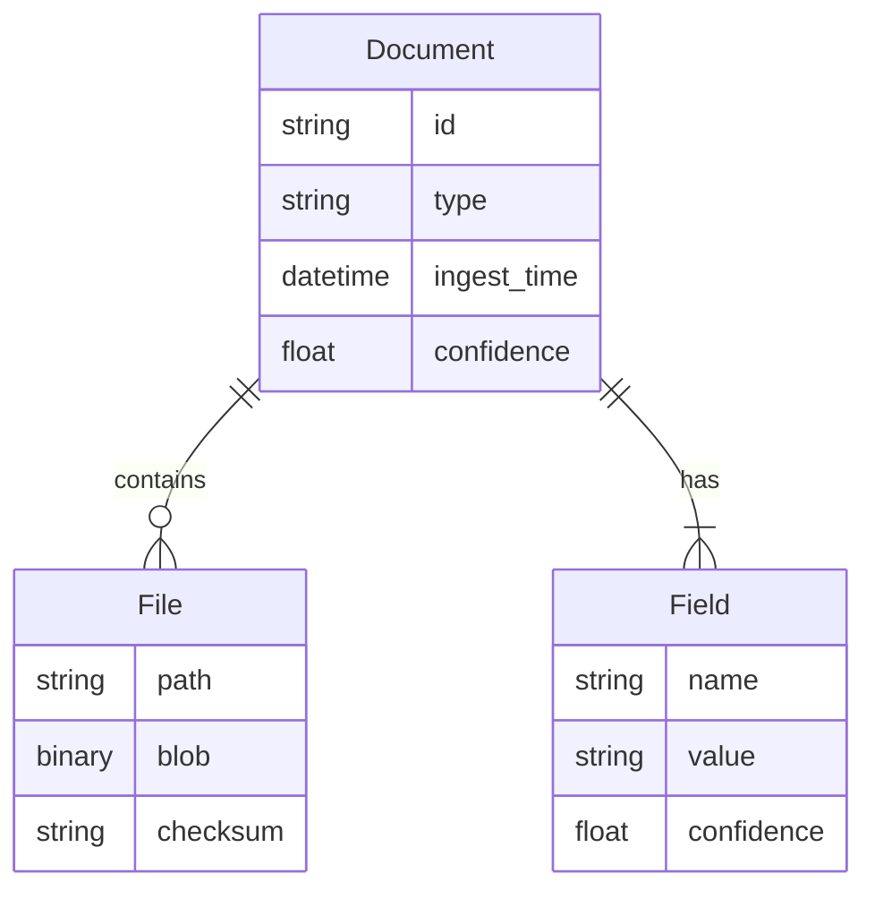

# Digitization Agent System Design Document

> **Version:** 0.1 – Draft  
> **Date:** 2025-07-20

---

## 1  Purpose & Scope
This document captures requirements and an initial high-level design for an automated “Digitization Agent” that ingests unstructured files on a workstation (starting with the `muaz` folder) and converts them into structured, queryable data.  Architectural choices (specific technologies, deployment topology, scaling strategy) will be finalised in a future Architecture Document.

## 2  Problem Statement
Manual digitisation of documents is time-consuming, inconsistent and error-prone. The organisation already maintains a substantial database and supporting APIs for trade documentation. New and historical files need to be ingested automatically, reducing manual effort while maintaining—or improving—data accuracy and traceability.

## 3  Existing Assets & Constraints
* **File corpus:** Diverse documents (PDFs, images) such as commercial invoices, packing lists, certificates.
* **Database:** In-house relational store containing parsed document fields and cross-references (shipment IDs, vendor codes, etc.).
* **Internal APIs:** REST/JSON endpoints for CRUD operations on documents, metadata lookups, duplicate detection, etc.
* **Security:** All processing must remain on-premises; no public cloud storage of raw files.
* **Hardware:** Workstation-class machine; GPU availability TBD.

## 4  Stakeholders
| Role | Interest |
|------|----------|
| Operations team | Faster document turnaround, minimal manual entry |
| Compliance | Audit trail of all transformations |
| IT | Maintainability, integration with existing systems |
| Management | Reporting, KPI tracking |

## 5  Functional Requirements
1. **File Monitoring**  
   Detect new/modified files within configured directories.
2. **Classification**  
   Identify document type (invoice, packing list, image, other).
3. **Content Extraction**  
   Extract text, tabular data, key-value pairs.
4. **Validation & Enrichment**  
   Match/merge with existing DB records, normalise fields (dates, currencies).
5. **Persistence**  
   Store original file and structured data in the master DB / blob storage.
6. **Error Handling**  
   Flag low-confidence extractions for human review.
7. **Auditing**  
   Log every transformation step with timestamps and actor IDs.
8. **Configuration UI (Phase 2)**  
   Allow admins to manage watched folders, thresholds, and mappings.

## 6  Non-Functional Requirements
| Category | Requirement |
|----------|-------------|
| Performance | Ingest ≥ 200 PDFs/hour on current hardware |
| Accuracy | ≥ 98 % field-level accuracy for invoices; ≥ 95 % overall |
| Reliability | 24×7 unattended operation, automatic restart on failure |
| Security | On-prem only; encrypted at rest and in transit |
| Maintainability | Modular codebase, automated tests (>80 % coverage) |
| Traceability | End-to-end provenance retained for each record |

## 7  External Interfaces
| API / Interface | Direction | Purpose |
|-----------------|-----------|---------|
| `POST /documents` | Outbound | Create/update document records |
| `GET /lookups/*` | Outbound | Resolve vendor, country, HS codes |
| Shared File System | Inbound | Source of raw files |
| TBD Message Bus | Outbound | Publish ingestion events |

## 8  Data Model Overview (Draft)

## 9  Component Outline (Names subject to change)
1. **Watcher** – detects file events.
2. **Classifier** – predicts document type.
3. **Extractor** – runs OCR / parsing.
4. **Validator** – cross-checks with DB & APIs.
5. **Persister** – writes outputs to storage.
6. **Review UI** – web interface for manual corrections.

## 10  Key Workflows
### 10.1 Happy Path
1. New PDF added to folder.
2. Watcher queues job.
3. Classifier → Extractor → Validator.
4. Persister saves structured record.
5. Event published: `document.ingested`.

### 10.2 Low Confidence
If overall confidence < threshold:
* Persister marks status `NEEDS_REVIEW`.
* Review UI presents side-by-side view for human approval.

## 11  Risks & Mitigations
| Risk | Impact | Mitigation |
|------|--------|------------|
| Poor OCR on noisy scans | Data gaps | Pre-processing, ML-based enhancement |
| Schema drift in existing DB | Integration failures | Versioned API contracts, integration tests |
| Large historical backlog | Processing delay | Batch import mode, parallel workers |

## 12  Open Questions
1. Exact database schema & API specs?  
2. GPU availability for accelerated OCR?  
3. Retention policy for raw files?

---

### Next Steps
1. Gather missing information (open questions above).  
2. Finalise architecture choices & deployment model.  
3. Create a proof-of-concept pipeline on the `muaz` sample files.
