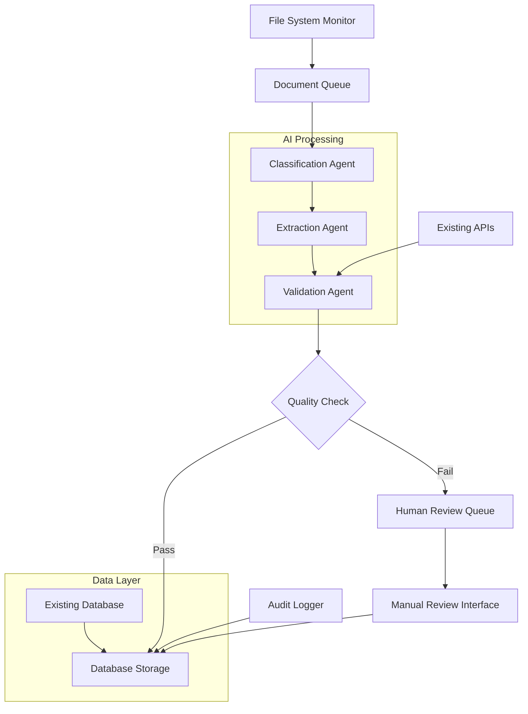
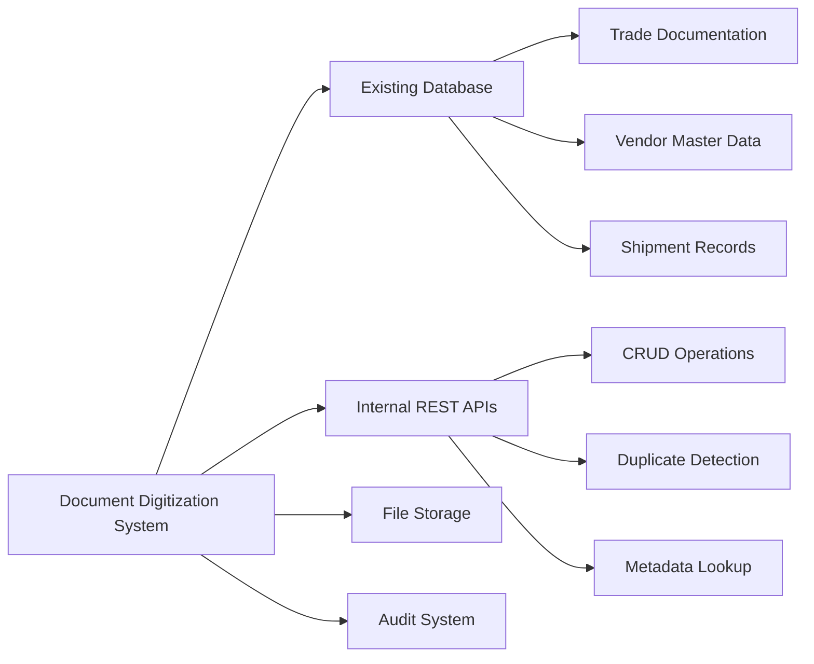

# Document Digitization System - System Design

> **🏗️ Complete System Architecture & Technical Specifications**  
> **📐 Production-ready design for automated document processing**  
> **⚡ Understand the entire system in 15 minutes**

---

## 🚀 System Overview (5 minutes)

**What is this system?** An automated document digitization agent that converts unstructured business documents (PDFs, images) into structured, queryable data using AI-powered multi-agent processing.

**Why do we need this system?** 
- ✅ **Eliminate Manual Work**: Reduce 80% of manual document processing time
- ✅ **Improve Accuracy**: Achieve >95% extraction accuracy vs human errors
- ✅ **Scale Operations**: Process 200+ documents/hour automatically
- ✅ **Ensure Compliance**: Complete audit trails for regulatory requirements

**How does it work?** 
```
Files → Monitor → Classify → Extract → Validate → Store → Review (if needed)
```
- **File monitoring** detects new documents automatically
- **AI classification** identifies document types (invoices, packing lists, etc.)
- **Multi-agent extraction** extracts structured data using Kimi-VL
- **Validation engine** ensures data quality and business rule compliance
- **Database integration** stores results in existing systems

**What are the key components?** 
- ✅ **Document ingestion** with file system monitoring
- ✅ **Multi-agent processing** using LLM orchestration
- ✅ **Kimi-VL integration** for vision-language understanding
- ✅ **Database integration** with existing trade documentation systems
- ✅ **Human review interface** for quality assurance

**What's the technical approach?** 
- **On-premises deployment**: All processing stays within your infrastructure
- **Multi-agent architecture**: Specialized agents for different processing stages
- **Existing system integration**: Leverages current database and APIs
- **Scalable design**: Handles current volume with room for growth

**What are the constraints?** 
- 🔴 **Security**: Must remain fully on-premises (no cloud storage)
- 🟡 **Hardware**: Limited to current workstation-class hardware
- 🟢 **Integration**: Must work with existing database and API systems

---

## 📊 System Requirements Analysis

### **Business Requirements**

| Requirement | Current State | Target State | Success Criteria |
|-------------|---------------|--------------|------------------|
| **Processing Speed** | Manual: 5-10 docs/hour | Automated: 200+ docs/hour | 20x speed improvement |
| **Accuracy** | Manual: 85-90% | Automated: >95% | Measurable improvement |
| **Manual Effort** | 100% manual review | <20% requiring review | 80% reduction in manual work |
| **Response Time** | Hours to days | Minutes to hours | Real-time processing |

### **Technical Requirements**

| Category | Requirement | Specification | Validation Method |
|----------|-------------|---------------|-------------------|
| **Performance** | Process ≥200 PDFs/hour | <18 seconds per document | Load testing |
| **Accuracy** | >95% extraction accuracy | Measured against ground truth | Quality metrics |
| **Availability** | 99% uptime during business hours | <1% downtime monthly | Monitoring |
| **Security** | On-premises only | No external data transmission | Security audit |
| **Integration** | Existing DB compatibility | RESTful API integration | Integration testing |

### **Stakeholder Requirements**

| Stakeholder | Primary Needs | Success Metrics | Acceptance Criteria |
|-------------|---------------|-----------------|-------------------|
| **Operations Team** | Fast, accurate processing | <20% manual review rate | User acceptance |
| **Compliance** | Complete audit trails | 100% operation logging | Audit approval |
| **IT Team** | Easy maintenance | <4 hours/month maintenance | Operational metrics |
| **Management** | Cost reduction & reporting | ROI tracking, dashboards | Business metrics |

---

## 🛠️ System Architecture

### **High-Level Architecture**



### **Component Specifications**

| Component | Technology Stack | Responsibility | Performance Target |
|-----------|------------------|----------------|-------------------|
| **File Monitor** | Python + Watchdog | Detect new/changed files | <1 second detection |
| **Classification Agent** | Kimi-VL + Custom Logic | Identify document types | >98% accuracy |
| **Extraction Agent** | Kimi-VL + LLM | Extract structured data | >95% field accuracy |
| **Validation Agent** | Business Rules Engine | Validate and enrich data | <2 seconds validation |
| **Database Integration** | Existing APIs + ORM | Store processed results | <1 second write |
| **Review Interface** | Web UI (React/FastAPI) | Human review workflow | <5 second response |

### **Data Flow Architecture**

1. **Ingestion**: File system monitoring detects new documents
2. **Classification**: AI determines document type and confidence
3. **Extraction**: Structured data extraction using vision-language models
4. **Validation**: Business rule validation and existing data cross-reference
5. **Storage**: Persistence in existing database with audit trails
6. **Review**: Low-confidence results routed to human reviewers

### **Integration Architecture**



---

## 🔧 Technical Specifications

### **Processing Pipeline Design**

#### **Stage 1: Document Ingestion**
```python
# File monitoring and queueing
class DocumentMonitor:
    def __init__(self, watch_directories):
        self.watch_dirs = watch_directories
        self.queue = DocumentQueue()
    
    def on_file_created(self, event):
        if self.is_supported_format(event.src_path):
            document = Document(path=event.src_path)
            self.queue.enqueue(document, priority='normal')
```

#### **Stage 2: Classification & Routing**
```python
class DocumentClassifier:
    def classify(self, document):
        # Use Kimi-VL for document type detection
        classification = self.kimi_vl.classify(document.image)
        
        return {
            'document_type': classification.type,
            'confidence': classification.confidence,
            'suggested_processor': self.get_processor(classification.type)
        }
```

### **Data Model Specifications**

#### **Document Entity Model**
```python
class ProcessedDocument:
    document_id: str
    original_filename: str
    document_type: str
    classification_confidence: float
    extraction_results: dict
    validation_status: str
    review_status: str
    processing_timestamp: datetime
    audit_trail: list[AuditEntry]
```

#### **Database Schema Integration**
```sql
-- Integration with existing trade documentation system
CREATE TABLE processed_documents (
    id UUID PRIMARY KEY,
    original_filename VARCHAR(255),
    document_type VARCHAR(50),
    classification_confidence DECIMAL(3,2),
    extraction_results JSONB,
    validation_status VARCHAR(20),
    review_status VARCHAR(20),
    processing_timestamp TIMESTAMP,
    created_at TIMESTAMP DEFAULT NOW()
);

-- Link to existing shipment records
ALTER TABLE processed_documents 
ADD COLUMN shipment_id VARCHAR(50) REFERENCES shipments(id);
```

### **Quality Assurance Framework**

#### **Confidence Scoring System**
| Confidence Level | Range | Action | Review Required |
|------------------|-------|--------|-----------------|
| **High** | 95-100% | Auto-approve | No |
| **Medium** | 80-94% | Flag for spot check | Optional |
| **Low** | 60-79% | Queue for review | Yes |
| **Very Low** | <60% | Reject or manual process | Yes |

#### **Validation Rules Engine**
```python
class ValidationEngine:
    def validate_invoice(self, extracted_data):
        rules = [
            self.validate_invoice_number_format,
            self.validate_date_ranges,
            self.validate_amount_consistency,
            self.cross_reference_vendor_data
        ]
        
        return [rule(extracted_data) for rule in rules]
```

---

## 📈 Performance & Scalability

### **Performance Targets**

| Metric | Target | Current Baseline | Measurement Method |
|--------|--------|------------------|-------------------|
| **Throughput** | 200 documents/hour | 10 documents/hour (manual) | Processing queue metrics |
| **Processing Time** | <18 seconds/document | 6 minutes/document | End-to-end timing |
| **Accuracy** | >95% field extraction | 85-90% (manual) | Quality assessment |
| **Availability** | 99% uptime | Manual operation | System monitoring |

### **Scalability Design**

#### **Horizontal Scaling Options**
- **Multi-threaded processing**: Parallel document processing
- **Queue-based architecture**: Async processing with Redis/RabbitMQ
- **GPU optimization**: Batch processing for Kimi-VL operations
- **Database optimization**: Connection pooling and query optimization

#### **Resource Utilization**
```yaml
hardware_requirements:
  minimum:
    cpu: "4 cores"
    ram: "16GB"
    storage: "500GB SSD"
    gpu: "Optional (8GB VRAM recommended)"
  
  recommended:
    cpu: "8 cores"
    ram: "32GB"
    storage: "1TB SSD"
    gpu: "16GB VRAM"
```

---

## 🔒 Security & Compliance

### **Security Architecture**

#### **Data Protection**
- **At Rest**: AES-256 encryption for stored documents
- **In Transit**: TLS 1.3 for all API communications
- **Access Control**: Role-based access with audit logging
- **Network Security**: Firewall rules for on-premises access only

#### **Compliance Framework**
| Requirement | Implementation | Validation |
|-------------|----------------|------------|
| **Audit Trail** | Complete operation logging | Audit log review |
| **Data Retention** | Configurable retention policies | Policy compliance check |
| **Access Logging** | All user actions logged | Access audit reports |
| **Data Privacy** | On-premises processing only | Infrastructure audit |

### **Security Controls**

```python
class SecurityManager:
    def __init__(self):
        self.audit_logger = AuditLogger()
        self.access_control = RoleBasedAccessControl()
    
    def log_document_access(self, user_id, document_id, action):
        self.audit_logger.log({
            'user_id': user_id,
            'document_id': document_id,
            'action': action,
            'timestamp': datetime.now(),
            'ip_address': request.remote_addr
        })
```

---

## 🚀 Implementation Roadmap

### **Phase 1: Core Processing (Weeks 1-4)**
- [ ] **Week 1-2**: File monitoring and document queue implementation
- [ ] **Week 3-4**: Basic classification and extraction with Kimi-VL

### **Phase 2: Integration & Validation (Weeks 5-8)**
- [ ] **Week 5-6**: Database integration and validation engine
- [ ] **Week 7-8**: Human review interface and workflow

### **Phase 3: Production Readiness (Weeks 9-12)**
- [ ] **Week 9-10**: Performance optimization and security hardening
- [ ] **Week 11-12**: Monitoring, alerting, and documentation

### **Success Criteria by Phase**

| Phase | Success Criteria | Validation Method |
|-------|------------------|-------------------|
| **Phase 1** | Process 50+ documents with >90% accuracy | Quality testing |
| **Phase 2** | Full integration with existing systems | Integration testing |
| **Phase 3** | Production deployment with monitoring | Operational testing |

---

## 📊 Monitoring & Operations

### **Key Performance Indicators**

| KPI | Target | Measurement | Frequency |
|-----|--------|-------------|-----------|
| **Processing Accuracy** | >95% | Validation against ground truth | Daily |
| **Throughput** | 200 docs/hour | Queue processing metrics | Hourly |
| **System Availability** | 99% | Uptime monitoring | Continuous |
| **Human Review Rate** | <20% | Review queue statistics | Daily |

### **Operational Procedures**

#### **Daily Operations**
- Monitor processing queue and clear any backlogs
- Review accuracy metrics and investigate anomalies
- Check system resource utilization
- Process human review queue

#### **Weekly Operations**
- Review performance trends and capacity planning
- Update document type classifications if needed
- Backup processed data and audit logs
- System maintenance and updates

#### **Monthly Operations**
- Comprehensive performance review
- Security audit and compliance check
- Stakeholder reporting and feedback collection
- System optimization and tuning

---

## 🎯 Success Metrics & Validation

### **Business Success Metrics**
- **Cost Reduction**: 80% reduction in manual processing costs
- **Time Savings**: 20x improvement in processing speed
- **Quality Improvement**: >95% accuracy vs 85-90% manual baseline
- **User Satisfaction**: >4.5/5 rating from operations team

### **Technical Success Metrics**
- **System Performance**: Meeting all performance targets
- **Integration Success**: Seamless operation with existing systems
- **Security Compliance**: Passing all security audits
- **Operational Efficiency**: <4 hours/month maintenance overhead

### **Acceptance Criteria**
- [ ] System processes 200+ documents per hour consistently
- [ ] Extraction accuracy exceeds 95% on test dataset
- [ ] Less than 20% of documents require human review
- [ ] Complete integration with existing database and APIs
- [ ] All security and compliance requirements met
- [ ] Operations team successfully trained and productive

---

**🎯 System Design Summary:** A production-ready automated document digitization system that transforms manual document processing into an efficient, accurate, and scalable AI-powered workflow while maintaining security and compliance requirements.

**⚡ Ready to implement?** This design provides the complete blueprint for building a robust document digitization system. Follow the implementation roadmap to deliver measurable business value! 🚀
